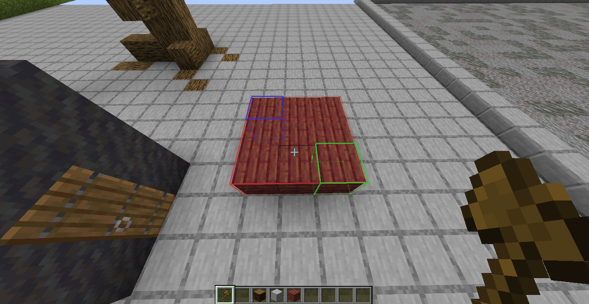

# 📦 LCTR Creative Modpack 🍂

1.19.4 sürümlü bu modpack performans ve daha kaliteli bir oyun verir.

**İçindekiler:**

- [Kurulum](#kurulum)
  - [Prism Launcher](#1-prism-launcher)
  - [Modpacki kurmak](#2-sonra)
- [Özellikler](#özellikler)
  - [Kalite](#qol-kalite)
  - [Performans](#performans)

---

## Kurulum

### 1. Prism Launcher

Prism Launcher kullanmanızı öneriyorum çünkü çok daha kolay ve daha otomatik. Aynı zamanda MC 1.19.4 için Java 17 gerekli.

- Premium hesabım var -> [Official Prism Launcher indir](https://prismlauncher.org/)

- **Premium hesabım yok/crack ->** [Cracked Prism Launcher indir](https://github.com/Diegiwg/PrismLauncher-Cracked#downloads-mediafire) (windows için `Windows-MSVC-Setup`)

- ❗ **Java 17 yok ise ->** [Java 17 indir](https://learn.microsoft.com/en-us/java/openjdk/download#openjdk-17)

### 2. Sonra?

Prism launcher'ı kurduktan sonra açın ve:

1. ➕ **Oturum Ekle (Add Instance)** butonuna basın.
2. 📁 **ZIP'ten içeri aktar (Import From Zip)**'e girin.
3. Bağlantı olarak 🔗 **[bu linkin adresini](https://github.com/TheAlan404/lctr-modpack/releases/latest/download/LCTR_Creative.zip)** yapıştırın (1)
4. ✅ **OK**'e basın.

5. İşlem tamamlanınca oynamak için 🚀 **Başlat (Launch)**'a basın (bundan sonra birdaha oyunu açmak için de bu butona basın).

Modpack'e herhangi bir güncelleme geldiğinde Prism Launcher sizin için otomatik güncelleyecektir. ☑️

(1): ([/releases](https://github.com/TheAlan404/lctr-modpack/releases)'den son release'in bağlantısı)

---

## ✨ Özellikler

### 🌸 QoL (Kalite)

- ⭐ **WorldEditCUI** ile WorldEdit seçiminizi oyunda görebilirsiniz.
  - `P`'ye basıp bu özelliği kapatıp açabilirsiniz.

[screen-recorder-sun-apr-23-2023-14-43-39.webm](https://user-images.githubusercontent.com/43997085/233839584-28e279a9-f2ee-4c5d-b70d-bec6f9d2b6b6.webm)

- ⭐ **Scroll For WorldEdit** sayesinde worldeditin bazı komutları çok daha kolay.
  - Komutu `R`'ye basılı tutup farelizin tekerleği ile seçin.
  - Aynı şekilde `alt`'a basılı tutup fareniz ile scroll yaparsanız komutu kullanmış olursunuz.
  - Bunları ayarlardan değiştirebilirsiniz (toggle yapılması, komut keybindları vb.)

[screen-recorder-sun-apr-23-2023-15-32-57.webm](https://user-images.githubusercontent.com/43997085/233840068-9f564221-a026-478d-a286-1cf03d280b94.webm)

- ⭐ **Command Macros** ise WorldEdit'in aldığı 3. powerup.
  - ⭐ `alt + SolTık` => Seçimi siler (`//set 0`)
  - ⭐ `alt + SağTık` => Elinizdeki blok ile doldurur (`//set hand`)
  - `ctrl + z` => Geri al (`//undo`)
  - `ctrl + y` => 'İleri' al (`//redo`)
  - `ctrl + c` => Kopyala (`//copy`)
  - `ctrl + v` => Yapıştır (`//paste`)
  - Sağ Shift => `//wand`

- **Screenshot to clipboard:** `F2` ile aldığınız screenshotlar otomatik olarak panoya kopyalanır.

- **TooptipFix** sayesinde tooltipler asla ekranın dışına çıkmıyor ve okunabilir oluyor.

- **3D Skin Layers** ile skinlere biraz daha detay ekleniyor.

- **Sound Physics Remastered** ...havalı sesler.

### 🛠️ Performans

- **Sodium, starlight, VMP, fastload, lithium, more culling, smooth boot, dash loader, memory leak fix, exordium** gibi bulunan modlar optifine'dan bile daha iyi performans vermeyi sağlıyor.

---

## bkz. diğer

[Burada](./BENCH.md) performans testleri var.
